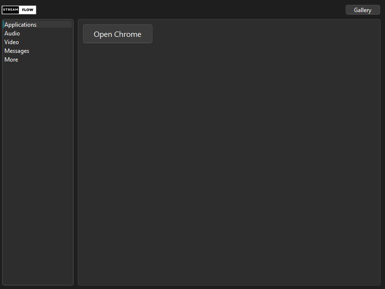
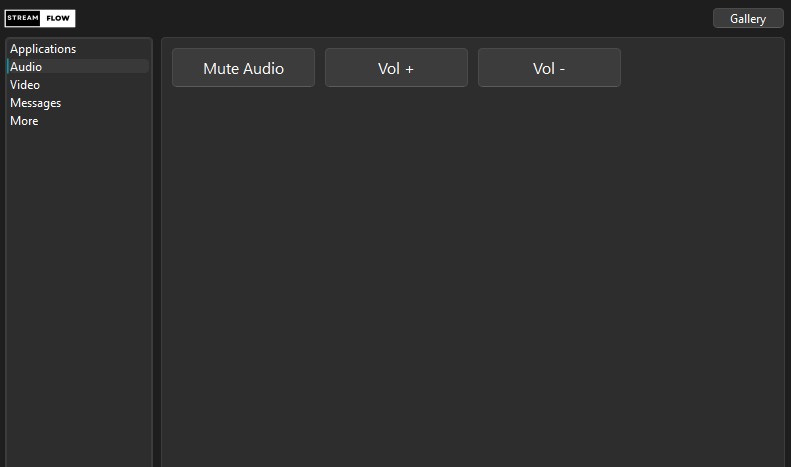

<p align="center">
  
</p>

# StreamFlow

StreamFlow is a local-first virtual stream deck for Windows, macOS, and Linux. It gives you customizable desktop button grids for opening websites, launching applications, controlling system audio, controlling OBS Studio, and running local commands without requiring a cloud backend or a paid API.

<p align="center">
  
  <br>
  
</p>

## What works

- Multiple profiles for separate streaming, work, gaming, or support decks.
- Import and export individual profiles as portable JSON files.
- Custom categories and button layouts.
- Add, edit, hide, delete, and reorder buttons from the UI.
- Right-click any deck button to edit or delete it.
- Persistent per-user configuration stored outside the repository.
- Open websites in the default browser.
- Launch applications and commands without invoking a shell by default.
- Explicit `shell:` actions when shell syntax is actually needed.
- System mute and volume controls on Windows, macOS, and common Linux audio stacks.
- OBS WebSocket controls for scenes, input mute, recording, and streaming.
- Optional custom icons.
- Headless unit tests that can run locally or in Docker.

## Install locally

```bash
git clone https://github.com/mergemaven11/streamflow.git
cd streamflow
python -m venv .venv
```

Activate the environment:

```bash
# Windows PowerShell
.\.venv\Scripts\Activate.ps1

# macOS / Linux
source .venv/bin/activate
```

Install and launch:

```bash
python -m pip install -r requirements.txt
python src/main.py
```

### Linux audio note

StreamFlow uses the first audio tool it finds: `wpctl` (PipeWire), `pactl` (PulseAudio), or `amixer` (ALSA). Install one of those through your Linux distribution if volume buttons report that no supported audio tool exists.

## OBS Studio setup

StreamFlow speaks directly to the OBS WebSocket 5.x server on your computer or local network. OBS Studio 28 and newer include obs-websocket by default.

1. Open OBS Studio.
2. Open the WebSocket server settings from the **Tools** menu.
3. Make sure the WebSocket server is enabled.
4. Keep authentication enabled and copy the password.
5. In StreamFlow, click **OBS**.
6. Enter the host, port, and password. The normal local settings are:
   - Host: `127.0.0.1`
   - Port: `4455`
7. Click **Test Connection**.

You can then create StreamFlow buttons for:

- **OBS: Switch scene** — enter the exact OBS scene name.
- **OBS: Toggle input mute** — enter the exact OBS input name, such as `Mic/Aux`.
- **OBS: Start / stop recording**
- **OBS: Start / stop streaming**

OBS credentials stay in your local StreamFlow configuration and are never sent to a cloud service.

## Profiles

Use the **Profiles** button to maintain separate decks.

- **New** creates a blank deck.
- **Duplicate** copies an existing deck.
- **Rename** changes the profile name.
- **Delete** removes a profile while ensuring at least one remains.
- **Import Profile** loads a `.json` deck.
- **Export Profile** saves one profile as a portable `.streamflow.json` file.

Existing StreamFlow configurations are migrated automatically into a profile named **Default** the first time this version loads them.

## Button actions

The UI builds these commands for you:

| Action | Stored command |
| --- | --- |
| Open website | `url:https://example.com` |
| Launch application | `app:/path/to/app` |
| Run command | `cmd:python --version` |
| Run shell expression | `shell:echo hello > output.txt` |
| System mute/unmute | `mute` |
| System volume up | `volume_up` |
| System volume down | `volume_down` |
| OBS scene switch | `obs_scene:Gaming` |
| OBS input mute toggle | `obs_mute:Mic/Aux` |
| OBS recording toggle | `obs_record_toggle` |
| OBS streaming toggle | `obs_stream_toggle` |

Use `shell:` only for commands that need shell features such as pipes, redirection, or environment expansion. Normal `app:` and `cmd:` actions launch the executable directly.

## Configuration

Edits are saved to `~/.streamflow/config.json`. Set `STREAMFLOW_CONFIG` to override that path for portable setups or testing.

The OBS password is stored only in that local configuration file. If the file is on a shared machine, protect it with normal operating-system file permissions.

## Tests

```bash
python -m pip install -r requirements-dev.txt
python -m pytest -q
```

Or build the test container locally:

```bash
docker compose run --rm test
```

The Docker configuration is intentionally for validation. StreamFlow is a native Qt desktop GUI, so exposing a fake HTTP port from a container is not useful.

## Cost

StreamFlow itself does not need GitHub Codespaces, GitHub Copilot, paid GitHub Actions minutes, a hosted AI model, or any paid API. You can develop, test, and run it entirely on your own machine.
